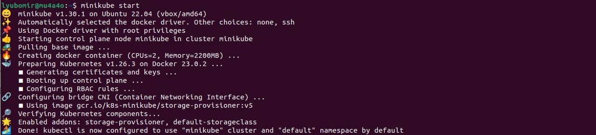
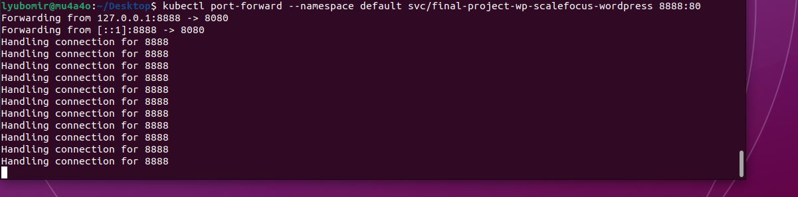
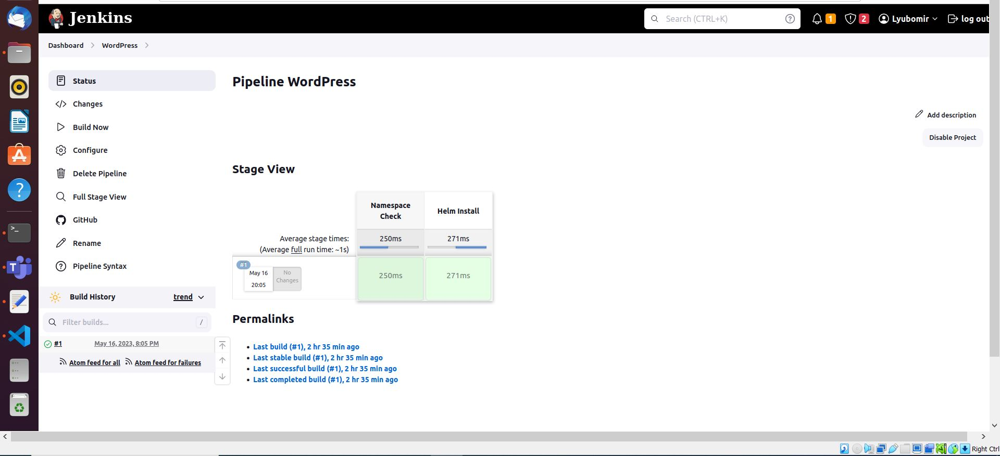
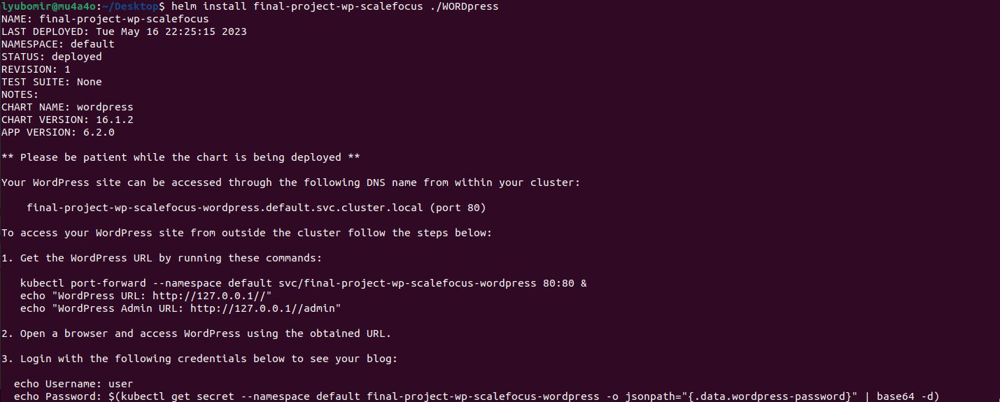
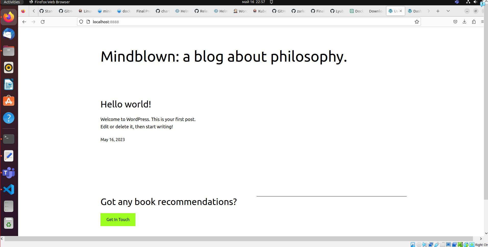
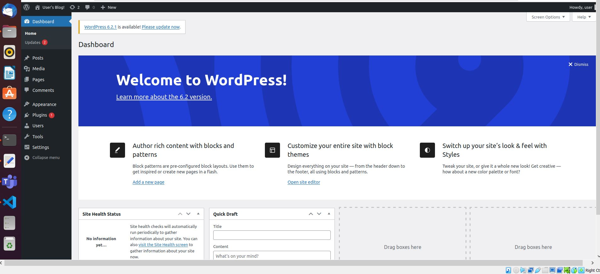

Final Project Assessment

Deploy a WordPress on Kubernetes (using Minicube) with Helm and
automation with Jenkins.
Prerequisites:
1. Install the necessary tools: Minikube, Helm and Jenkins.
First you need to install Minikube , here the official site and documentation for installation: https://minikube.sigs.k8s.io/docs/start/
Here is the link to install Helm :  https://helm.sh/docs/intro/install/
Here is the link to install Jenkins :  https://www.jenkins.io/doc/book/installing/linux/
2. Separate repo in your GitHub Profile named: Final Project Assessment for Scalefocus Academy
Requirement for the Project Assessment:

 
1. Download Helm chart for WordPress. ( Bitnami chart:
https://github.com/bitnami/charts/tree/main/bitnami/wordpress )
2. In values.yaml, you need to change line 543 from type: LoadBalancer to type: ClusterIP ( Hint: there
will be one more problem when deploying. Resolve it. – change the port forward for wordpress with a free port ,because port 8080 is used by Jenkins.
 
3. Create a Jenkins pipeline that checks if wp namespace exists, if it doesn’t then it creates one.
Checks if WordPress exists, if it doesn’t then it installs the chart.
 
4. Name the Helm Deployment as: final-project-wp-scalefocus.
 
5. Deploy the helm chart using the Jenkins pipeline.
 
6. Load the home page of the WordPress to see the final result.
 
 
7. Explain the project directly in a README.md file in your project repo.
BONUS POINTS:
- Instead of using Minicube, consider using a different Kubernetes flavor of your choice, like k3s, k8s,
microK8s for bonus points during the grading.
8. Send the URL of your Project repo on email to ana.zjovanovska@scalefocus.com &
kiro.velkovski@scalefocus.com titled “Final Project Assessment for Scalefocus Academy”.
